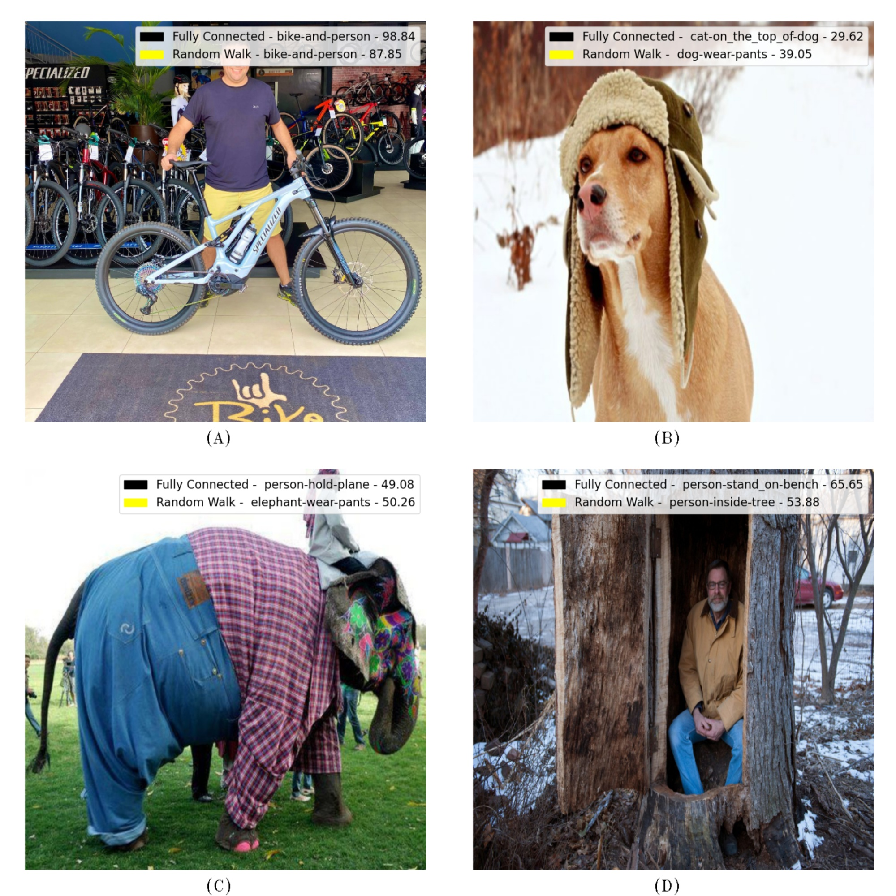

# 
 Image Classification through Graph Neural Networks and Random Walks 

### Proposed Approach
--------

Taking as approach the Random Walk method, which can be applied to compute large networks, searching for communities based in a network structured in graph.
We assume that a graph convolutional network model can have better accuracy than an end-to-end model, using context images to train the model, which uses a fully connected graph to link the edges of each node.
We took the method as a base to help decrease the connections in a graph and reduce the computational need, taking in that deep learning models can be computationally expensive.
We extracted information from images (bounding box) using a pre-trained model. The values extracted contain image features like borders, the difference between colors, texture, space and other information.

  

 <em>Figure 1 - Graph Optimization</em>

### Results
-------

Figure 2 shows examples of images classified by the GCNFC and GCNRW. In Figure 2 (a), both approaches correctly classify the image. However, considering Figure 2 (c) and (d), the GCNFC cannot reach the correct classification. For instance, in Figure 2 (c), the correct class was elephant-wear-pants, and the GCNFC classified it as person-hold-plane. This same behavior occurred in Figure
2 (d); our approach reached the correct classification (i.e., person-inside-tree). In Figure 2 (b), both approaches failed, however, we can notice that our approach reached a context more similar to the correct classification (dog-wear-pants)
when compared to the GCNFC classification (cat-on-the-top-of-dog)

  

 <em>Figure 2 - Classification Results</em>

